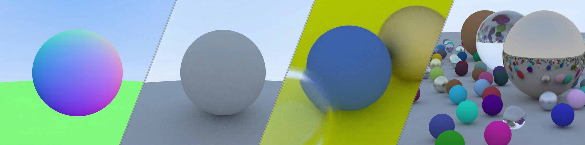
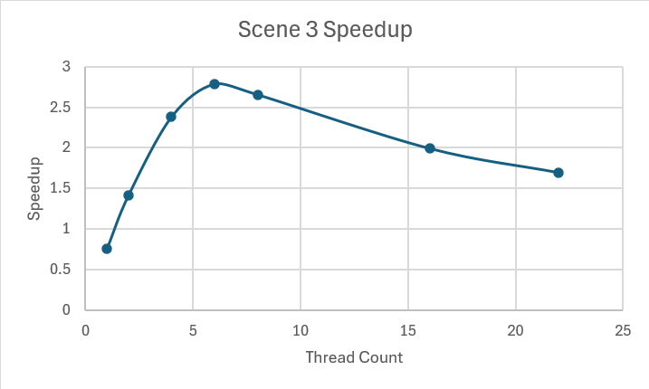

# Hi there, I'm Isa 👋

  
   
  <em>A few frames from my own Ray Tracer.</em>

> [!TIP]
> **Open to Graphics / Rendering Programmer roles and internships** (Summer 2026 onward).

## 🎓 About Me
I am a Software Engineering graduate pursuing a **Master's in Games Engineering at WMG, University of Warwick**. I spend most of my time on **real-time rendering** and **computer graphics**: writing renderers, reading papers, and figuring out why the image looks wrong. I play video games too (shocking, I know 🎮), and my ultimate goal is to push the boundaries of visual fidelity as a **Graphics Programmer**.

📄 [**Download my CV**](assets/CV-IsaGeriler.pdf)

## 🔭 Current Focus
I am currently strengthening my foundation in the **Graphics Pipeline**, **C++**, and **DirectX 12 (DX12)**. 

Recently, I was selected for a graphics-focused Master's dissertation under the supervision of **Dr. Thomas Bashford-Rogers**. My current studies and personal projects are dedicated to building the low-level technical groundwork required for this upcoming research.

## 🛠️ Tech Stack
| Category | Technologies |
| :--- | :--- |
| **Languages** |   |
| **Graphics APIs** |  |
| **Scripting & Processing** |   |
| **Tools & Profiling** |   |

---

## 🚀 Featured Projects

### [**Path Tracer & Light Transport Engine**](https://github.com/IsaGeriler/RTBase_5749205)
A multithreaded, physically based CPU renderer in C++, built to explore advanced light transport and microfacet models. 

> [!NOTE]
> **Why it matters:** Simulates highly realistic lighting and materials using industry-standard math and data structures, dramatically reducing render times and visual noise through spatial optimizations and Intel AI denoising.

*   **Architecture:** Implements three integrators: Path Tracing, Light Tracing, and Instant Radiosity (which uses a Halton quasi-Monte Carlo sampler relying on prime bases for the Radical Inverse). 
*   **Material Framework:** GGX microfacets (Conductor BSDF, sampled proportionally to the NDF), Plastic (Phong), Diffuse, Oren-Nayar, Glass, Mirror, and a Layered BSDF evaluating Beer's Law for attenuation.
*   **Performance:** Render time and variance are heavily optimized using a **Binned SAH BVH (Surface Area Heuristics Bounding Volume Hierarchy)**, tile-based multithreading, and **Multiple Importance Sampling (MIS)** for latitude-longitude environment maps.
*   **Denoising:** Custom AOV outputs feed directly into **Intel OIDN** for machine-learning-based post-process denoising.

**Tech:** <kbd>C++</kbd> · <kbd>Multithreading</kbd> · <kbd>BVH</kbd> · <kbd>MIS</kbd> · <kbd>PBR Math</kbd> · <kbd>Intel OIDN</kbd>

  
  

<em>128 spp reference (left) vs. 16 spp denoised with Intel OIDN (right). Achieves comparable fidelity at a fraction of the compute cost.</em>

  

<em>Materials test: GGX conductor, Plastic, Oren-Nayar, Glass, and Mirror BSDFs.</em>

---

### [**Optimized Software Rasterizer**](https://github.com/IsaGeriler/WM9M4AssignmentRasterizer5749205)
A CPU implementation of the graphics pipeline, hand-optimized for throughput using hardware-level parallelization (SIMD and multithreading). 

> [!IMPORTANT]
> **Hardware Profiling & The "Thread Plateau"**  
> I profiled how performance scales with thread count on my Intel Core Ultra 7 155H, a hybrid CPU with 6 Performance cores, 8 Efficiency cores, and 2 Low-Power Efficiency cores (16 cores / 22 threads). SIMD (SSE/AVX) plus multithreading gave large early gains, but as shown below the speedup peaks at roughly 2.8x around 6 threads and then degrades. That inflection lines up with the Performance-core count: the first threads land on the fast P-cores, and scaling past them onto the slower E-cores, LP-cores, and hyperthreads adds workers that are both slower and competing for shared resources, so throughput stops improving and starts to regress.

**Tech:** <kbd>C++</kbd> · <kbd>SIMD (SSE/AVX)</kbd> · <kbd>Multithreading</kbd> · <kbd>Performance Profiling</kbd>

  

<em>Scene 3 profiling: speedup peaks near the Performance-core count, then degrades as work spills onto slower Efficiency cores and hyperthreads.</em>

  
  
  

---

### [**DX12Engine (WIP)**](https://github.com/IsaGeriler/DX12Engine)
A modern, custom rendering engine being built from scratch using DirectX 12 to master low-level GPU programming.

> [!NOTE]
> **Why it matters:** Transitioning from CPU rendering to modern, explicit GPU APIs. Focuses on manual memory management, synchronization, and resource binding.

*   **Current Features:** Working through Descriptor Heaps, Root Signatures, and Pipeline State Objects (PSOs). 
*   **Evolution:** This serves as a re-architected, highly scalable improvement over my initial [DirectX 12 Coursework Framework](https://github.com/IsaGeriler/WM9M2Assignment5749205).

**Tech:** <kbd>C++</kbd> · <kbd>HLSL</kbd> · <kbd>DirectX 12</kbd> · <kbd>GPU Memory Management</kbd>

  

---

### [**Offline Ray Tracer (WIP)**](https://github.com/IsaGeriler/RayTracer)
A proving ground for light-transport math based on the *Ray Tracing in One Weekend* (Shirley et al., 2025) architecture. I have extended the base engine to include **Motion Blur** and implemented a custom **Bounding Volume Hierarchy (BVH)** to drastically reduce spatial-intersection costs. The per-pixel render loop and the BVH build are both parallelized using C++17 `std::execution::par` to maximize CPU utilization.

**Tech:** <kbd>C++17</kbd> · <kbd>Ray Tracing</kbd> · <kbd>Motion Blur</kbd> · <kbd>BVH Acceleration</kbd>

  

<em>Integrated Motion Blur calculation.</em>

---

### [**Software Rasterizer (Foundations)**](https://github.com/IsaGeriler/Rasterizer)
An engine built entirely from scratch to deeply understand the math behind graphics APIs. Instead of using existing math libraries (like GLM), I wrote the matrix, vector, and homogeneous coordinate mathematics myself. Implements the full Model-View-Projection (MVP) chain, perspective-correct interpolation, depth buffering (Z-buffer), and Lambertian lighting, parsing `.gem` meshes to render pixel-perfect geometry.

**Tech:** <kbd>C++</kbd> · <kbd>3D Math</kbd> · <kbd>MVP Pipeline</kbd> · <kbd>Z-buffer</kbd>

  
  

<em>Stanford bunny parsed from a .gem mesh: Lambertian shaded (left) and raw geometry (right).</em>

---

### [**C++ Client-Server Chat Room**](https://github.com/IsaGeriler/WM9M4AssignmentChatRoom5749205)
A multithreaded networking application showcasing system-level programming outside of graphics. Built a custom client-server architecture using WinSock. The server concurrently handles multiple clients, while the client utilizes a **Dear ImGui** graphical interface. Features include public broadcasting, private 1-to-1 DMs, and real-time **FMOD** audio notifications.

**Tech:** <kbd>C++</kbd> · <kbd>Multithreading</kbd> · <kbd>WinSock (Networking)</kbd> · <kbd>Dear ImGui</kbd> · <kbd>FMOD</kbd>

  

---

## 📫 Let's Connect

