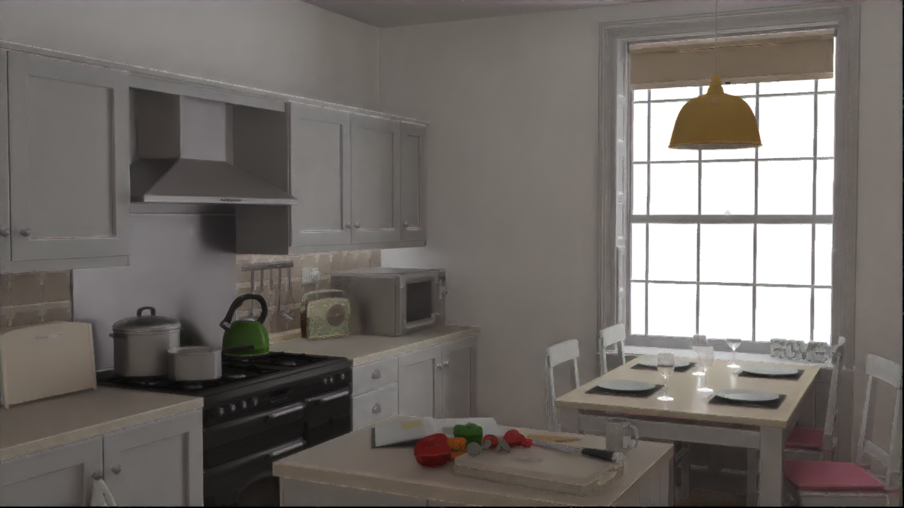
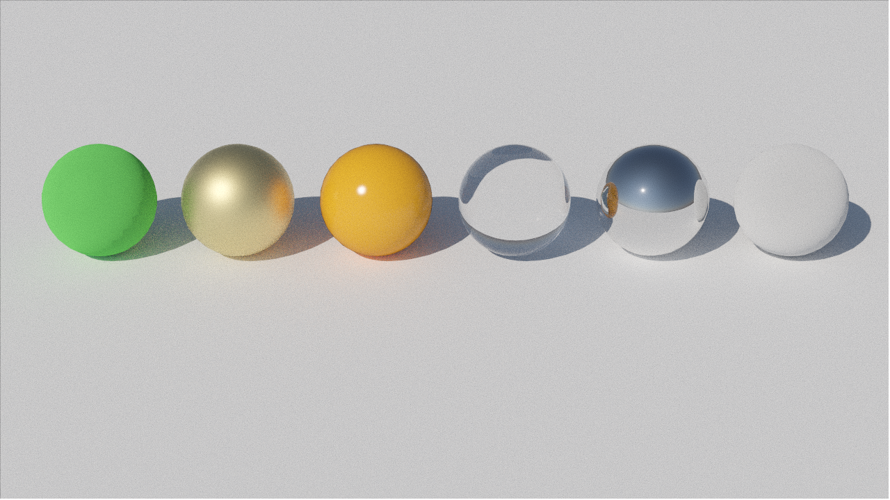
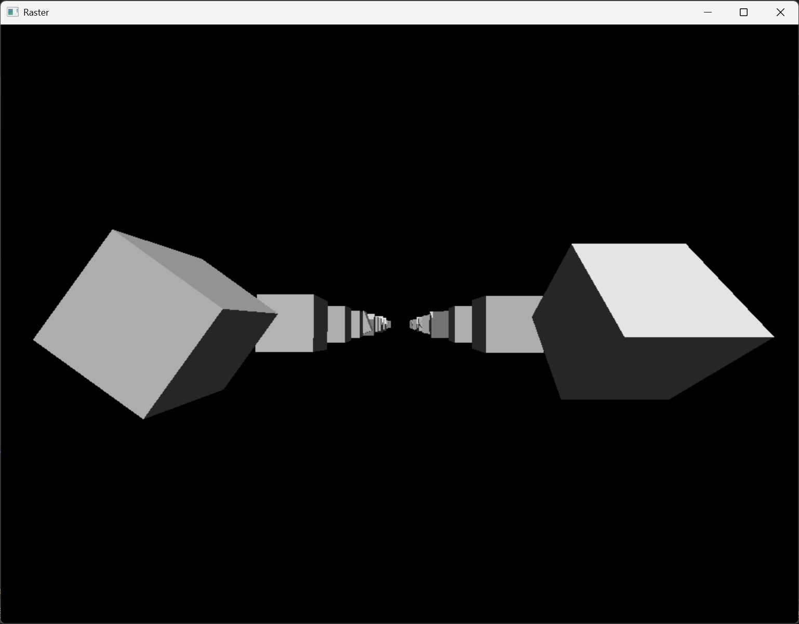
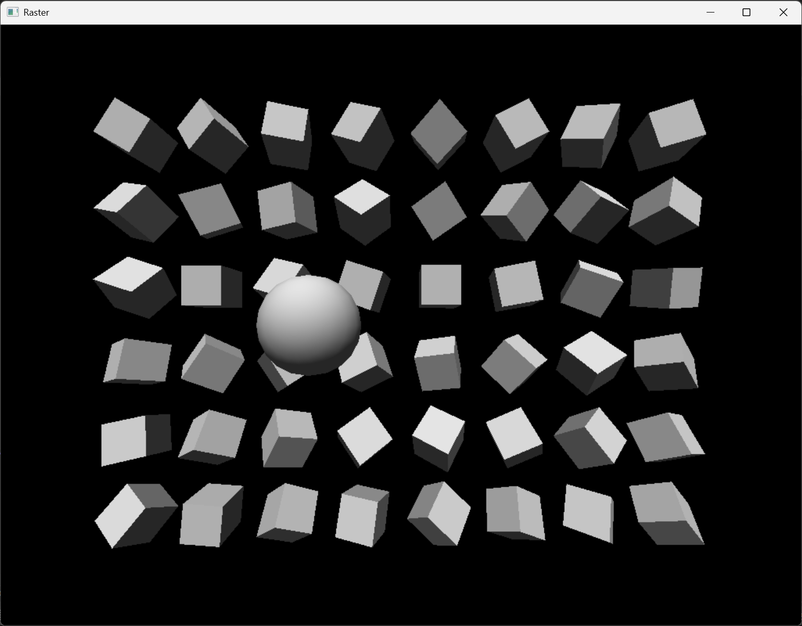
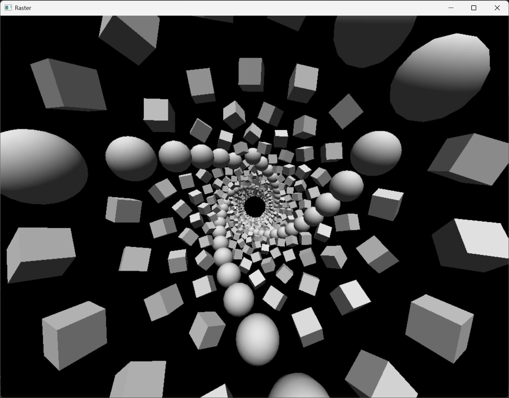
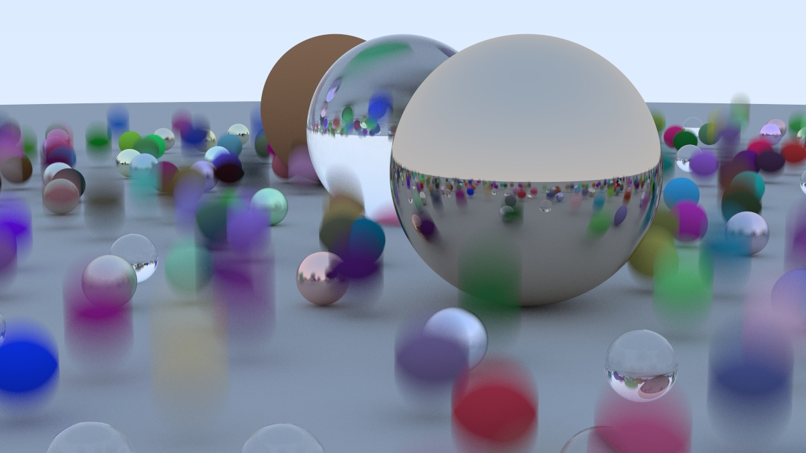
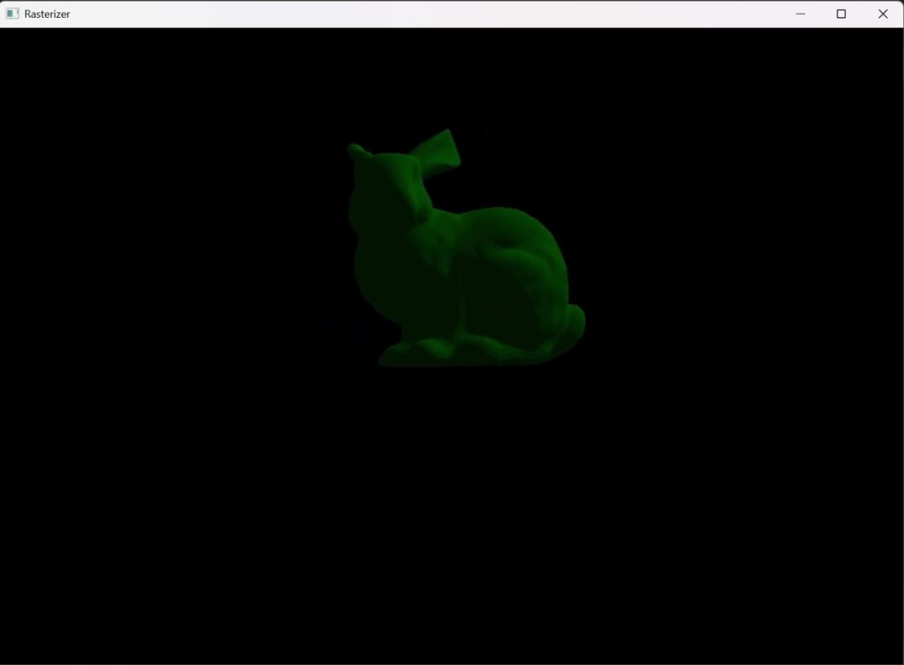
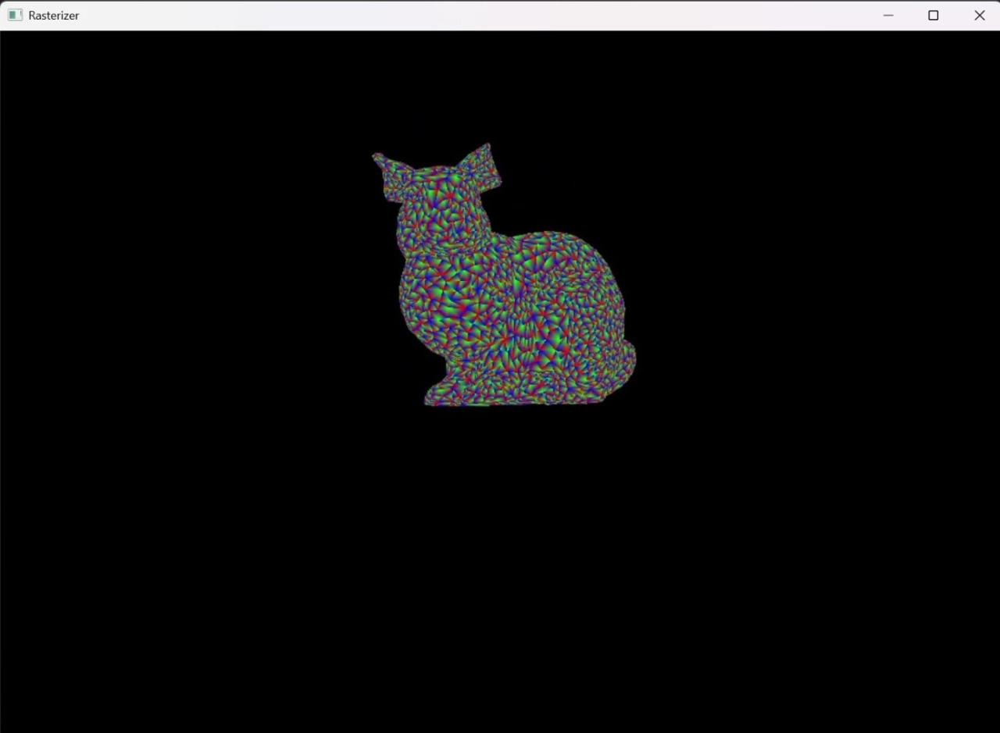
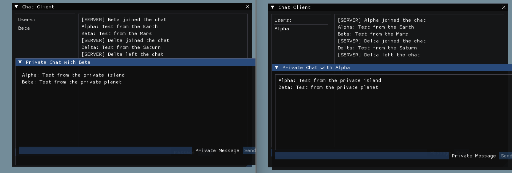
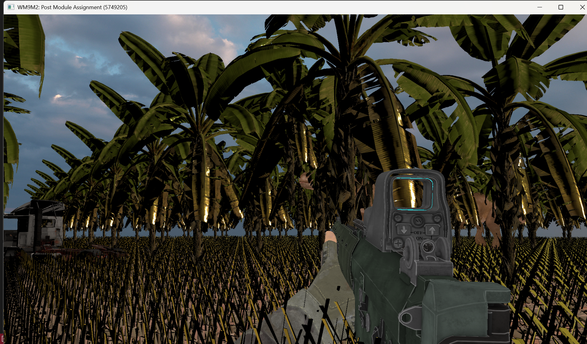

# Hi there, I'm Isa 👋

  
   
  <em>"変わる伝説、新たな歴史 - The Legend Evolves, A New History Begins."</em>

## 🎓 About Me
I am a Software Engineering graduate currently pursuing a **Master's in Games Engineering at WMG, University of Warwick**.

Passionate about video games (surprise, Sherlock 🕵️‍♂️), **real-time rendering**, **computer graphics**, and the math behind the pixels. My goal is to specialize as a Graphics Programmer, bridging the gap between artistic vision and hardware performance.

## 🔭 Current Focus
Currently, I am strengthening my foundation in the **Graphics Pipeline**, **C++**, and **DirectX 12 (DX12)**.

Recently, I was selected for a graphics-focused Master's dissertation under the supervision of **Dr. Thomas Bashford-Rogers**. My current studies are dedicated to building the technical groundwork required for this upcoming research.

## 🛠️ Tech Stack
| Category | Technologies |
| :--- | :--- |
| **Languages** |   |
| **Graphics API** |  |
| **Scripting & Processing** |   |
| **Tools & Version Control** |   |

## 🚀 Featured Projects
Here are some of the projects I'm proud of:

### [**Path Tracer & Light Transport Engine**](https://github.com/IsaGeriler/RTBase_5749205)
*An extended, CPU-based multithreaded, Physically Based Renderer written in C++, built to explore advanced light transport and microfacet models. The core architecture supports standard Path Tracing alongside Instant Radiosity and Light Tracing integrators. For the Instant Radiosity implementation, Halton Sampler (a quasi-Monte Carlo sampler) is utilized, relying on prime bases for the Radical Inverse. The material framework handles GGX Microfacets (Conductor BSDF, sampled proportionally to the NDF), Plastic BSDF (using Phong model), Oren-Nayar BSDF, and Layered BSDF which evaluating Beer's Law for attenuation. Render times and variance are managed via a Binned SAH BVH, tile-based rendering, Multiple Importance Sampling (MIS) for Latitude-Longitude based Environment Maps (utilizing a luminance-based PDF), and custom AOV outputs to support Intel OIDN for denoising (post-processing).*

  
  

<em>Kitchen scene: 128 spp reference (left) vs. 16 spp denoised with Intel OIDN (right).</em>

  

<em>Materials test: GGX conductor, Plastic, Oren-Nayar, Glass, and Mirror BSDFs.</em>

### [**Optimized Software Rasterizer**](https://github.com/IsaGeriler/WM9M4AssignmentRasterizer5749205)
*A CPU-based implementation of the graphics pipeline, accelerated using optimization techniques and multithreading.*
- **Tech:** C++, SIMD (SSE/AVX, AVX2), Multi-threading

  
  
  

### [**Offline Ray Tracer (WIP)**](https://github.com/IsaGeriler/RayTracer)
*An ongoing multithreaded offline ray tracer (CPU-based), written in C++, acting as a proving ground for light transport math. Currently encompasses the full Ray Tracing in One Weekend (Shirley et al., 2025) architecture, extending into book two with integrated Motion Blur and a custom Bounding Volume Hierarchy (BVH) to drop spatial intersection costs. The BVH build is parallelized utilizing C++17 executions (std::execution::par) to keep the CPU fed. Actively working through the rest of the trilogy to build out the full advanced feature set.*

  

<em>Motion blur, integrated from book two.</em>

### [**Software Rasterizer (Legacy)**](https://github.com/IsaGeriler/Rasterizer)
*Earlier implementation of rasterization techniques. Implements the full Model-View-Projection (MVP) transformation chain, perspective-correct interpolation, depth buffering, and Lambertian lighting using a math library written from scratch, for matrices, vectors, and homogeneous coordinates. Parses .gem mesh files and renders with pixel-perfect rasterization.*

  
  

<em>Stanford bunny parsed from a .gem mesh: shaded (left) and geometry (right).</em>

### [**Chat Room**](https://github.com/IsaGeriler/WM9M4AssignmentChatRoom5749205)
*A client-server chat room application built from scratch using WinSock for networking. The server handles multiple clients concurrently, while the client features a graphical interface built with Dear ImGui. Supports public broadcast messages and private 1-to-1 direct messages (DMs). FMOD integration provides real-time sound notifications for incoming messages.*

  

### [**DX12Engine (WIP)**](https://github.com/IsaGeriler/DX12Engine)
*A custom rendering engine built from scratch using DirectX 12.*
- **Goal:** To master low-level concepts including Descriptor Heaps, Root Signatures, and Pipeline State Objects (PSOs).
- **Evolution:** This will be the re-architected and improved version of my previous framework ([Coursework Submission](https://github.com/IsaGeriler/WM9M2Assignment5749205)).

  

## 📫 Let's Connect

<!--
**IsaGeriler/IsaGeriler** is a ✨ _special_ ✨ repository because its `README.md` (this file) appears on your GitHub profile.

Here are some ideas to get you started:

- 🔭 I’m currently working on ...
- 🌱 I’m currently learning ...
- 👯 I’m looking to collaborate on ...
- 🤔 I’m looking for help with ...
- 💬 Ask me about ...
- 📫 How to reach me: ...
- 😄 Pronouns: ...
- ⚡ Fun fact: ...
-->
